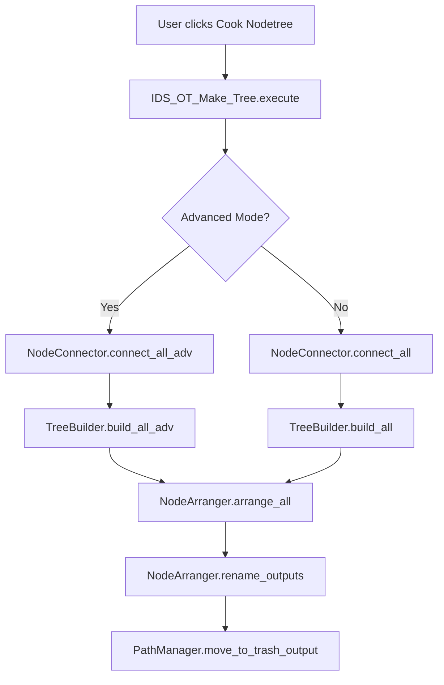

# Industrial AOV Connector - AI Agent Context

> **Purpose**: This document provides AI assistants with essential context for understanding and modifying this Blender addon codebase.

## Quick Reference

| Item | Value |
|------|-------|
| **Blender Versions** | 4.2 - 5.0+ |
| **License** | GPL-3.0-or-later |
| **Author** | Roland Vyens |
| **Main Entry** | `__init__.py` |

---

## Architecture Overview

```
Industrial-AOV-Connector/
├── __init__.py              # Addon registration, bl_info
├── constants.py             # All magic strings and constants
├── handy_functions.py       # Utility classes & functions
├── sort_passes.py           # PassSorter class
├── path_modify_v2.py        # PathManager for output paths
├── renderpath_preset.py     # TokenReplacer for render farm
├── language_lib.py          # i18n translations
│
├── core/
│   ├── preferences.py       # Addon preferences (IDS_AddonPreference)
│   ├── properties.py        # Scene properties (IDS_props)
│   └── node_builder.py      # ★ MAIN LOGIC: TreeBuilder, NodeConnector, NodeArranger
│
├── operators/
│   ├── basic_ops.py         # Denoise, CloudMode, DeleteTrash operators
│   ├── data_layer_ops.py    # DATA layer creation/management
│   └── tree_ops.py          # IDS_OT_Make_Tree, IDS_OT_Update_Tree, IDS_OT_Arr_Tree
│
└── ui/
    └── panels.py            # IDS_PT_* panel classes
```

---

## Core Classes

### `core/node_builder.py` — The Heart of the Addon

#### `TreeBuilder`
Creates compositor nodes for view layers.

| Method | Purpose |
|--------|---------|
| `build_all()` | Create nodes for ALL view layers |
| `build_current()` | Create nodes for CURRENT view layer only |
| `build_all_adv()` | Advanced mode: handles DATA layers + FakeDeep |
| `build_current_adv()` | Advanced mode for current layer |

#### `NodeConnector`
Connects nodes after creation.

| Method | Purpose |
|--------|---------|
| `connect_all()` | Connect all view layer nodes |
| `connect_current()` | Connect current view layer nodes |
| `connect_all_adv()` | Advanced mode connections |
| `connect_current_adv()` | Advanced mode for current |

#### `NodeArranger`
Positions and organizes nodes visually.

| Method | Purpose |
|--------|---------|
| `arrange_all()` | Master arrange function |
| `arrange_viewlayers()` | Position RenderLayer nodes |
| `arrange_outputs()` | Position FileOutput nodes |
| `arrange_denoise()` | Position Denoise nodes |
| `arrange_math()` | Position math/vector nodes |
| `frame_data_layers()` | Create frame around DATA layers |

---

### `handy_functions.py` — Utilities

#### `BlenderCompat` (Class)
Version compatibility layer. **Must call `BlenderCompat.init(package_name)` on register.**

| Attribute | Purpose |
|-----------|---------|
| `is_blender_5_plus` | True if Blender >= 5.0 |
| `diffuse_color_name` | "Diffuse Color" or "DiffCol" |
| `addon_package` | Package name for prefs lookup |
| `separate_xyz_node_id` | Node type ID (varies by version) |

#### `CompositorHelper` (Class)
Abstracts compositor API differences between Blender versions.

| Method | Purpose |
|--------|---------|
| `get_node_tree(scene)` | Get compositor node tree (handles B5.0 API change) |
| `is_enabled(scene)` | Check if compositor enabled |
| `set_output_path(node, path)` | Set file output path (B5.0 uses `directory`+`file_name`) |
| `add_slot(node, name)` | Add input slot to file output node |

#### `DataLayerHelper` (Class)
DATA layer automation utilities.

---

### `sort_passes.py` — PassSorter

Collects and categorizes render passes from view layers.

```python
sorter = PassSorter(scene)
viewlayer_full, viewlayers = sorter.sort()
# viewlayer_full = {
#     "LayerNameColor": ["Image", "DiffDir", ...],
#     "LayerNameData": ["Normal", "Position", ...],
#     "LayerNameVector": ["Normal", "Position"],
#     "LayerNameCrypto": ["CryptoObject00", ...],
# }
```

---

## Key Scene Properties

All prefixed with `IDS_` on `bpy.context.scene`:

| Property | Type | Purpose |
|----------|------|---------|
| `IDS_ConfIg` | Enum | OPTION1=Separate RGBA/DATA, OPTION2=All-in-one |
| `IDS_AdvMode` | Bool | Enable advanced mode |
| `IDS_UseDATALayer` | Bool | Enable DATA layer support |
| `IDS_UsedN` | Bool | Create denoise nodes |
| `IDS_SepCryptO` | Bool | Separate cryptomatte output |
| `IDS_UseAdvCrypto` | Bool | Advanced crypto on regular layers |
| `IDS_DelNodE` | Bool | Delete existing nodes before build |
| `IDS_ArtDepth` | Bool | Create artistic depth (normalized) |
| `IDS_fakeDeep` | Bool | Create FakeDeep node for depth AA |
| `IDS_Autoarr` | Bool | Auto-arrange nodes |

---

## Naming Conventions

### Node Names
Format: `{ViewLayerName}--{Suffix}`

| Suffix | Node Type |
|--------|-----------|
| `RgBA` | RGBA file output |
| `DaTA` | DATA file output |
| `CryptoMaTTe` | Cryptomatte output |
| `{pass}_Dn` | Denoise node |
| `{pass}_Break` | Separate XYZ |
| `{pass}_Combine` | Combine XYZ |
| `{pass}_Inv` | Math invert (multiply -1) |

### DATA Layer Detection
View layers are DATA layers if:
- Name starts with `-_-exP_` (DATA_LAYER_PREFIX)
- Name contains `_DATA` (DATA_LAYER_SUFFIX)

---

## Execution Flow



---

## Common Modification Scenarios

### Adding a new pass type
1. Add constant to `constants.py`
2. Update `PassSorter._categorize_passes()` in `sort_passes.py`
3. Handle in `TreeBuilder._build_*` methods
4. Handle in `NodeConnector._connect_*` methods

### Adding a new operator
1. Create class in appropriate `operators/*.py` file
2. Register in `operators/__init__.py`'s `classes` list
3. Add to UI in `ui/panels.py`

### Changing node arrangement
1. Modify `NodeArranger` methods in `core/node_builder.py`
2. Constants like spacing are in `constants.py`

---

## Version Compatibility Notes

### Blender 5.0+ Changes
- `scene.node_tree` → `scene.compositor_node_tree`
- File output `base_path` → `directory` + `file_name`
- Node spacing increased (use `NODE_SPACING_BLENDER_5`)

### Handled by `BlenderCompat` and `CompositorHelper`
All version-specific code is abstracted through these classes.

---

## Testing Recommendations

1. **Test file**: `layer_demo.blend` in addon root
2. **Key scenarios**:
   - Build all layers (normal mode)
   - Build all layers (advanced mode with DATA layers)
   - Update single layer
   - Cryptomatte separate vs combined
   - Denoise enabled/disabled

---

## Path Management

### `path_modify_v2.py` — PathManager

Manages output file paths for FileOutput nodes.

| Method | Purpose |
|--------|---------|
| `get_single_folder_path()` | Get base render path (without trash_output) |
| `get_subfolder_paths()` | Returns `[rgba_path, data_path, crypto_path]` |
| `move_to_trash_output()` | Redirect Blender's default output to trash_output/ |
| `create_final_path(view_layer, output_type)` | Generate full output path for a layer |

### `renderpath_preset.py` — TokenReplacer

Handles render farm path preparation with token replacement.

**Supported Tokens:**
| Token | Replacement |
|-------|-------------|
| `$scene$` | Scene name |
| `$file$` | Blend filename (without extension) |
| `$viewlayer$` | Current view layer name |
| `$camera$` | Camera name (or "NoCamera") |
| `$version$` | Last 4 chars of filename (e.g., "v001") |

**Storage**: Original paths stored in node custom property `IDS_original_path`

---

## Addon Preferences Reference

Stored in `core/preferences.py` as `IDS_AddonPrefs`:

| Preference | Default | Purpose |
|------------|---------|---------|
| `Denoise_Col` | True | Denoise DiffCol/GlossCol/TransCol |
| `Use_Old_Layer_Naming` | False | Legacy EXR layer names |
| `Put_Default_To_trash_output` | False | Redirect default render to trash |
| `Show_QuickDel` | False | Show delete trash button |
| `Only_Create_Enabled_Viewlayer` | True | Skip disabled layers |
| `Auto_Data_Sample` | False | Auto-optimize DATA layer samples |
| `Custom_Data_Sample` | 10 | Sample count for DATA layers |
| `Custom_Suffix` | `####` | Custom filename suffix with tokens |
| `Arrange_Scale_Param` | 1.0 | Node spacing scale (for HiDPI) |
| `Horizontal_DATA_Arrange` | True | Arrange DATA layers horizontally |
| `UI_Show_In_Comp` | False | Show panel in Compositor N-panel |

---

## All Operators Reference

### Tree Operations (`operators/tree_ops.py`)
| Operator ID | Purpose |
|-------------|---------|
| `compositor.make_tree` | Build nodes for ALL view layers |
| `compositor.update_tree` | Update CURRENT view layer only |
| `compositor.arr_tree` | Arrange connector nodes |

### Basic Operations (`operators/basic_ops.py`)
| Operator ID | Purpose |
|-------------|---------|
| `compositor.use_nodes` | Enable compositor |
| `rendering.use_denoise_passes` | Turn on denoise for all layers |
| `compositor.cloudmodeids` | Toggle render farm path prep |
| `render.delete_trashoutput` | Delete trash_output folder |
| `scene.setmaterialaov` | Auto-set shader AOVs |

### DATA Layer Operations (`operators/data_layer_ops.py`)
| Operator ID | Purpose |
|-------------|---------|
| `viewlayer.makedatalayernew` | Create new empty DATA layer |
| `viewlayer.makedatalayercopy` | Create DATA layer from current |
| `viewlayer.convertdatalayer` | Convert current to DATA layer |
| `viewlayer.overridedatamat` | Override material + create AOVs |
| `wm.drawdatalayermenu` | Show DATA layer menu |

### Utility (`handy_functions.py`)
| Operator ID | Purpose |
|-------------|---------|
| `viewlayer.idspreference` | Open addon preferences |

---

## UI Panels

### `ui/panels.py`

| Panel Class | Location | ID |
|-------------|----------|-----|
| `IDS_PT_OutputPanel` | Properties > View Layer | `RENDER_PT_industrialoutput` |
| `IDS_PT_OutputPanel_N` | Compositor > N-Panel | `COMP_PT_industrialoutput` |

Both inherit from `IDS_PT_OutputPanel_Base` which contains all drawing logic.

---

## Constants Reference (`constants.py`)

### Key Constants

| Constant | Value | Usage |
|----------|-------|-------|
| `DATA_LAYER_PREFIX` | `-_-exP_` | Identifies DATA layers |
| `DATA_LAYER_SUFFIX` | `_DATA` | Alternative DATA layer identifier |
| `NODE_NAME_SEPARATOR` | `--` | Separates layer name from suffix |
| `TRASH_OUTPUT_FOLDER` | `trash_output` | Default render redirect folder |

### Output Folders
- `RGBAs/` — RGBA outputs
- `DATAs/` — DATA outputs  
- `Cryptomatte/` — Cryptomatte outputs

### Node Suffixes (for identification)
- `RgBA`, `DaTA`, `CryptoMaTTe`, `AlL` — Output nodes
- `_Dn` — Denoise nodes
- `_Break`, `_Combine`, `_Inv` — Vector conversion nodes

---

## Code Quality Notes

- **Rating**: 7.5/10
- **Strengths**: Modular class architecture, good helper extraction, bilingual docs
- **Opportunities**: Some duplication between `_adv` and non-`_adv` methods; consider factory pattern for node creation

---

## Packaging for Distribution

### Files to Include

| Directory | Files |
|-----------|-------|
| Root | `__init__.py`, `constants.py`, `handy_functions.py`, `language_lib.py`, `sort_passes.py`, `path_modify_v2.py`, `renderpath_preset.py`, `asset.blend`, `blender_manifest.toml` |
| `core/` | `__init__.py`, `node_builder.py`, `preferences.py`, `properties.py` |
| `operators/` | `__init__.py`, `basic_ops.py`, `data_layer_ops.py`, `tree_ops.py` |
| `ui/` | `__init__.py`, `panels.py` |

### Files to Exclude

- `.git/`, `__pycache__/` — Dev/build artifacts
- `AGENT.md`, `README.md`, `LICENSE`, `manual/` — Documentation (not needed at runtime)
- `layer_demo.blend` — Test file
- `.gitignore`

### Python Pack Script

> [!IMPORTANT]
> Use Python's `zipfile` module—PowerShell's `Compress-Archive` creates backslash paths and missing directory entries, causing Blender's "manifest not found" error.

```python
import zipfile
import os

source = r'path\to\Industrial-AOV-Connector'
dest = os.path.join(source, 'Industrial-AOV-Connector.zip')

files_to_include = [
    '__init__.py', 'constants.py', 'handy_functions.py', 'language_lib.py',
    'sort_passes.py', 'path_modify_v2.py', 'renderpath_preset.py',
    'asset.blend', 'blender_manifest.toml',
    'core/__init__.py', 'core/node_builder.py', 'core/preferences.py', 'core/properties.py',
    'operators/__init__.py', 'operators/basic_ops.py', 'operators/data_layer_ops.py', 'operators/tree_ops.py',
    'ui/__init__.py', 'ui/panels.py'
]

with zipfile.ZipFile(dest, 'w', zipfile.ZIP_DEFLATED) as zf:
    # Add directory entries (required for Blender)
    for folder in ['Industrial-AOV-Connector/', 'Industrial-AOV-Connector/core/', 
                   'Industrial-AOV-Connector/operators/', 'Industrial-AOV-Connector/ui/']:
        zf.writestr(folder, '')
    
    # Add files with forward slashes
    for f in files_to_include:
        zf.write(os.path.join(source, f), 'Industrial-AOV-Connector/' + f)

print(f'Created: {dest}')
```
