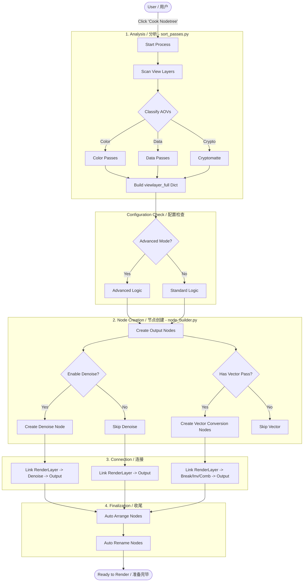

# Industrial AOV Connector Architecture / 工业化 AOV 连接器架构文档

This document provides a high-level overview of the addon's architecture, designed to help developers understand the codebase structure and data flow.
本文档提供了插件架构的高级概述，旨在帮助开发者理解代码库结构和数据流。

---

## 1. Directory Structure / 目录结构

The project follows a modular architecture separates logic (Core), execution (Operators), and presentation (UI).
本项目采用模块化架构，将逻辑（Core）、执行（Operators）和展示（UI）分离开来。

### `root/`
- **`__init__.py`**: The entry point. Handles registration of all classes and the translation dictionary.
  **入口点**。处理所有类和翻译字典的注册。
- **`handy_functions.py`**: Utility functions and the `BlenderCompat` class for handling Blender version differences (Active vs output attributes).
  **工具函数**。包含通用工具函数和用于处理 Blender 版本差异（Active 与 output 属性）的 `BlenderCompat` 类。
- **`language_lib.py`**: Contains the massive translation dictionary for UI localization.
  **语言库**。包含用于 UI 本地化的大型翻译字典。
- **`sort_passes.py`**: Analyzes view layers to categorize passes (Data, Color, Crypto).
  **通道排序**。分析视图层以对通道进行分类（Data, Color, Crypto）。

### `core/`
- **`node_builder.py`**: **The Brain**. Contains all logic for creating, connecting, and arranging compositor nodes. This is the largest and most complex module.
  **核心大脑**。包含所有用于创建、连接和排列合成器节点的逻辑。这是最大且最复杂的模块。
- **`preferences.py`**: Defines the addon's global preferences (User Interface & System settings).
  **偏好设置**。定义插件的全局偏好设置（用户界面和系统设置）。
- **`properties.py`**: Defines per-scene properties (`IDS_*`) used to store configuration state.
  **属性**。定义用于存储配置状态的每个场景的属性（`IDS_*`）。

### `operators/`
- **`tree_ops.py`**: Operators that trigger node tree generation and arrangement (`IDS_OT_Make_Tree`, `IDS_OT_Update_Tree`).
  **节点树操作**。触发节点树生成和排列的操作符。
- **`data_layer_ops.py`**: Operators for managing specialized "Data Layers" (creating, converting, overriding materials).
  **数据层操作**。用于管理专用"数据层"的操作符（创建、转换、覆盖材质）。
- **`basic_ops.py`**: Simple utility operators (e.g., toggling denoise).
  **基础操作**。简单的工具操作符（例如，切换降噪）。

### `ui/`
- **`panels.py`**: Defines the UI panels in the Properties window and Compositor N-panel.
  **面板**。定义属性窗口和合成器 N 面板中的 UI 面板。

---

## 2. Key Components & Logic / 关键组件逻辑

### The Node Building Process / 节点构建流程

The core functionality revolves around the "Cook Nodetree" button. The flow is as follows:
核心功能围绕 "Cook Nodetree"（烘焙节点树）按钮展开。流程如下：

1.  **Analysis (`sort_passes.py`)** / **分析**
    - The `sort_passes()` function scans all View Layers.
    - It categorizes available AOVs into `Color` (Beauty, Diffuse, Glossy), `Data` (Normal, Depth, UV), and `Crypto` (Cryptomatte).
    - `sort_passes()` 函数扫描所有视图层。
    - 它将可用的 AOV 分类为 `Color`（美景、漫射、光泽）、`Data`（法线、深度、UV）和 `Crypto`（Cryptomatte）。

2.  **Creation (`core/node_builder.py`)** / **创建**
    - `make_tree_denoise()` (or `_adv` in advanced mode) iterates through the analyzed data.
    - Examples:
      - **RGBA Node**: Created for standard color passes.
      - **DATA Node**: Created for utility passes (32-bit float).
      - **Denoise Node**: Injected for noisy passes if enabled.
    - `make_tree_denoise()`（或高级模式下的 `_adv`）遍历分析出的数据。
    - 例如：
      - **RGBA 节点**：为标准颜色通道创建。
      - **DATA 节点**：为工具通道（32位浮点）创建。
      - **降噪节点**：如果启用，则为噪点通道注入降噪节点。

3.  **Connection (`core/node_builder.py`)** / **连接**
    - `auto_connect()` links the Render Layer sockets to the newly created Denoise and Output nodes.
    - It handles special logic like:
      - **Vector Conversion**: Converting Blender coords to Nuke coords (Flip Y/Z).
      - **Normalization**: Normalizing depth for artistic use.
    - `auto_connect()` 将渲染层插槽连接到新创建的降噪和输出节点。
    - 它处理特殊逻辑，例如：
      - **向量转换**：将 Blender 坐标转换为 Nuke 坐标（翻转 Y/Z）。
      - **归一化**：为艺术用途归一化深度。

4.  **Arrangement (`core/node_builder.py`)** / **排列**
    - `auto_arrange_viewlayer()` calculates heights and vertically stacks nodes for clean layout.
    - `auto_arrange_viewlayer()` 计算高度并垂直堆叠节点以获得整洁的布局。

---

## 3. Version Compatibility / 版本兼容性

### `BlenderCompat` Class / `BlenderCompat` 类
Located in `handy_functions.py`, this class abstracts API changes between Blender versions (e.g., 3.x vs 4.x vs 5.0).
位于 `handy_functions.py` 中，此类抽象了 Blender 版本之间的 API 更改（例如 3.x vs 4.x vs 5.0）。

- **Usage**: Instead of checking `bpy.app.version` everywhere, code accesses `BlenderCompat.separate_xyz_node_id`.
- **Initialization**: `BlenderCompat.init()` is called during `register()` in `__init__.py`.
- **用法**：代码访问 `BlenderCompat.separate_xyz_node_id`，而不是到处检查 `bpy.app.version`。
- **初始化**：在 `__init__.py` 的 `register()` 期间调用 `BlenderCompat.init()`。

---

## 4. Advanced Features / 高级功能

### Data Layers / 数据层
The addon supports "Data Layers" - specific View Layers dedicated to non-beauty passes to save render time.
插件支持"数据层" - 专用于非美景通道的特定视图层，以节省渲染时间。
- Logic handles separating these from main RGBA renders.
- Controlled via `operators/data_layer_ops.py`.
- 逻辑处理将其与主 RGBA 渲染分离。
- 通过 `operators/data_layer_ops.py` 控制。

### Path Management / 路径管理
- `path_modify_v2.py` provides path manipulation functions for organizing output files.
- `renderpath_preset.py` handles token replacement (`$scene`, `$version`, `$camera`, `$file`) in output paths.
- Code ensures paths are "Crash-Safe" by verifying directory existence before render.
- `path_modify_v2.py` 提供路径操作函数以组织输出文件。
- `renderpath_preset.py` 处理输出路径中的令牌替换（`$scene`, `$version`, `$camera`, `$file`）。
- 代码通过在渲染前验证目录存在来确保路径是"防崩溃"的。

---



> *Note: Diagram uses Mermaid syntax. If not rendering, view the simplified ASCII version below.*
> *注：图表使用 Mermaid 语法。若是无法渲染，请查看下方的简化 ASCII 版本。*

```
[User / 用户]
     │
     ▼
[Click "Cook Nodetree"] ──┐
                          │
┌─────────────────────────▼─────────────────────────────┐
│ 1. ANALYSIS / 分析 (sort_passes.py)                   │
│                                                       │
│ [Scan View Layers] → [Classify AOVs]                  │
│                          │                            │
│           ┌──────────────┼──────────────┐             │
│           ▼              ▼              ▼             │
│     [Color List]    [Data List]   [Crypto List]       │
│           │              │              │             │
│           └───────► [Build Dict] ◄──────┘             │
└─────────────────────────┬─────────────────────────────┘
                          │
┌─────────────────────────▼─────────────────────────────┐
│ 2. CONFIG & CREATION / 配置与创建 (node_builder.py)    │
│                                                       │
│          [Is Advanced Mode?] ──► [Advanced Logic]     │
│                   │                                   │
│                   └──► [Standard Logic]               │
│                                │                      │
│                ┌───────────────▼──────────────┐       │
│                │ Create File Output Nodes     │       │
│                │ (RGBA, DATA, CRYPTO)         │       │
│                └───────────────┬──────────────┘       │
│                                │                      │
│        ┌───────────────┬───────┴───────┬──────────┐   │
│        ▼               ▼               ▼          │   │
│ [Denoise Nodes]  [Vector Converters]  [Fake Deep] │   │
└─────────────────────────┬─────────────────────────────┘
                          │
┌─────────────────────────▼─────────────────────────────┐
│ 3. CONNECTION / 连接                                  │
│                                                       │
│ RenderLayer ──► [Denoise] ───────► Output Node        │
│ RenderLayer ──► [Vector Conv] ───► Output Node        │
│ RenderLayer ──► [Color/Data] ────► Output Node        │
└─────────────────────────┬─────────────────────────────┘
                          │
┌─────────────────────────▼─────────────────────────────┐
│ 4. FINALIZATION / 收尾                                │
│                                                       │
│ [Arrange Nodes] ──► [Rename Nodes] ──► [Ready!]       │
└───────────────────────────────────────────────────────┘
```

---

## 6. Configuration Modes / 配置模式

### Standard Mode (IDS_AdvMode = False) / 标准模式

| Option | Behavior |
|--------|----------|
| **OPTION1** | Separate RGBA (16-bit) and DATA (32-bit) files<br>分离 RGBA（16位）和 DATA（32位）文件 |
| **OPTION2** | Single ALL file (32-bit) with all passes<br>单个 ALL 文件（32位）包含所有通道 |

### Advanced Mode (IDS_AdvMode = True) / 高级模式

Adds control over:
新增控制：
- **Compression codecs** per file type (ZIPS, DWAA, etc.)
  每种文件类型的压缩编码器
- **Data Layers** - Dedicated view layers for depth/normal passes
  数据层 - 专用于深度/法线通道的视图层
- **Cryptomatte separation** - Optional third output file
  Cryptomatte 分离 - 可选的第三个输出文件
- **Fake Deep** - Special depth pass for nuke's Deep From Image node
  假 Deep - 用于 nuke 的 Deep From Image 节点的特殊深度通道

---

## 7. Naming Conventions / 命名约定

### Node Naming Pattern / 节点命名模式

All nodes follow this pattern:
所有节点遵循此模式：

```
{ViewLayerName}--{NodeType}
```

**Examples / 示例:**
- `ViewLayer--RgBA` - RGBA file output node
- `ViewLayer--DaTA` - DATA file output node
- `ViewLayer--CryptoMaTTe` - Cryptomatte file output node
- `ViewLayer--Diffuse_Dn` - Denoise node for Diffuse pass
- `ViewLayer--Normal_Break` - Vector breakdown node for Normal pass

**Why this pattern? / 为什么使用此模式？**
- The `--` separator allows easy parsing: `node_name.split('--')` gets `[ViewLayer, NodeType]`
- Enables bulk operations on all nodes for a specific view layer
- `--` 分隔符允许轻松解析
- 支持对特定视图层的所有节点进行批量操作

---

## 8. Core Data Structures / 核心数据结构

### `viewlayer_full` Dictionary / 字典

The heart of the system. Built by `sort_passes()`:
系统核心。由 `sort_passes()` 构建：

```python
viewlayer_full = {
    "ViewLayerColor": ["Image", "Diffuse", "Glossy", "Transmission"],
    "ViewLayerData": ["Depth", "Normal", "UV", "Position"],
    "ViewLayerVector": ["Normal", "Position"],  # Subset requiring XYZ conversion
    "ViewLayerCrypto": ["CryptoObject00", "CryptoMaterial00"],
    
    # If multiple view layers exist:
    "LightsColor": ["Image", "Emission"],
    "LightsData": ["Depth"],
    "LightsVector": [],
    "LightsCrypto": []
}
```

**Key Rules / 关键规则:**
- Each view layer gets 4 keys: `{Name}Color`, `{Name}Data`, `{Name}Vector`, `{Name}Crypto`
- `Vector` is a **subset** of `Data` - passes requiring coordinate conversion
- Material AOVs can be moved from `Color` to `Data` in Advanced Mode
- 每个视图层获得 4 个键
- `Vector` 是 `Data` 的子集 - 需要坐标转换的通道
- 在高级模式下，材质 AOV 可以从 `Color` 移至 `Data`

---

## 9. Code Examples / 代码示例

### Example 1: Adding a Custom Pass Handler / 添加自定义通道处理器

```python
# In core/node_builder.py

def create_custom_pass_node(tree, view_layer, pass_name):
    """Create a node for a custom pass type.
    为自定义通道类型创建节点。
    """
    custom_node = tree.nodes.new("CompositorNodeBrightContrast")
    custom_node.name = f"{view_layer}--{pass_name}_Custom"
    custom_node.label = f"{view_layer}_{pass_name}_CUSTOM"
    custom_node.hide = True
    custom_node.location = 700, 0
    return custom_node
```

### Example 2: Accessing Addon Preferences / 访问插件偏好设置

```python
# Anywhere in the code / 代码中的任何位置

from .handy_functions import BlenderCompat

preferences = bpy.context.preferences
addon_prefs = preferences.addons[BlenderCompat.addon_package].preferences

# Access settings / 访问设置
if addon_prefs.Denoise_Col:
    # Apply denoising to color passes
    # 对颜色通道应用降噪
    pass
```

### Example 3: Extending with a New Operator / 扩展新操作符

```python
# In operators/basic_ops.py

class IDS_OT_My_Custom_Operator(bpy.types.Operator):
    bl_idname = "compositor.my_custom_op"
    bl_label = "My Custom Operation"
    bl_description = "Does something useful"
    bl_options = {"REGISTER", "UNDO"}
    
    def execute(self, context):
        # Your logic here / 你的逻辑
        self.report({"INFO"}, "Operation completed!")
        return {"FINISHED"}

# Don't forget to register in __init__.py!
# 不要忘记在 __init__.py 中注册！
```

---

## 10. Troubleshooting Guide / 故障排除指南

### Common Issues / 常见问题

**Problem: Nodes not being created / 节点未被创建**
- **Check:** Is compositing enabled? (`Use Nodes` in Compositor)
- **Check:** Are view layers enabled for rendering? (Eye icon in Outliner)
- **Debug:** Add `print()` statements in `make_tree_denoise()` to trace execution
- **检查:** 合成是否启用？
- **检查:** 视图层是否启用渲染？
- **调试:** 在 `make_tree_denoise()` 中添加 `print()` 语句跟踪执行

**Problem: Duplicate nodes appearing / 出现重复节点**
- **Cause:** `IDS_DelNodE` preference is disabled
- **Fix:** Enable "Clear Nodes When Running Cook Nodetree" in preferences
- **原因:** `IDS_DelNodE` 偏好设置被禁用
- **修复:** 在偏好设置中启用"烘焙节点树时删除所有节点"

**Problem: Path variables not replaced / 路径变量未被替换**
- **Check:** Are render handlers registered? They trigger `replaceTokens()`
- **Debug:** Check console for errors during `register()` in `__init__.py`
- **检查:** 渲染处理程序是否已注册？
- **调试:** 检查控制台在 `__init__.py` 的 `register()` 期间是否有错误

### Debugging Tips / 调试技巧

1. **Print the dictionary / 打印字典:**
   ```python
   viewlayer_full, viewlayers = sort_passes()
   print(viewlayer_full)  # Already done by default
   ```

2. **Inspect node tree / 检查节点树:**
   ```python
   node_tree = get_compositor_node_tree(bpy.context.scene)
   for node in node_tree.nodes:
       print(f"{node.name}: {node.type}")
   ```

3. **Check Blender version compatibility / 检查 Blender 版本兼容性:**
   ```python
   print(f"Blender {bpy.app.version}")
   print(f"Is 5+: {BlenderCompat.is_blender_5_plus}")
   ```

---

## 11. Performance Considerations / 性能考虑

- **`node_builder.py` is heavy** - It iterates through all view layers and passes multiple times
  **`node_builder.py` 很重** - 它多次遍历所有视图层和通道
- **Arrangement calculations** - Done via `node.dimensions`, which can be slow for many nodes
  **排列计算** - 通过 `node.dimensions` 完成，对于许多节点可能会很慢
- **Optimization tip** - Use "Update Current Viewlayer" instead of "Cook Nodetree" when iterating
  **优化提示** - 迭代时使用"更新当前视图层"而不是"烘焙节点树"

---

## 12. Future Refactoring Opportunities / 未来重构机会

1. **Split `node_builder.py`** into smaller modules:
   - `node_creation.py` - Node creation logic
   - `node_connection.py` - Connection logic  
   - `node_arrangement.py` - Layout logic
   
2. **Extract magic strings** to `constants.py`:
   ```python
   NODE_SUFFIX_RGBA = "RgBA"
   NODE_SUFFIX_DATA = "DaTA"
   ```

3. **Add unit tests** for `sort_passes()` and helper functions

将 `node_builder.py` 拆分为更小的模块，提取魔法字符串到常量，添加单元测试。
