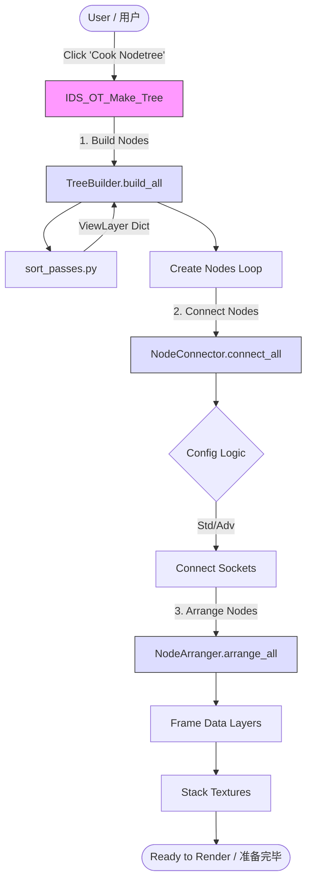

# Industrial AOV Connector Architecture / 工业化 AOV 连接器架构文档

This document provides a high-level overview of the addon's architecture, designed to help developers understand the codebase structure and data flow.
本文档提供了插件架构的高级概述，旨在帮助开发者理解代码库结构和数据流。

---

## 1. Directory Structure / 目录结构

The project follows a modular architecture that separates logic (Core), execution (Operators), and presentation (UI).
本项目采用模块化架构，将逻辑（Core）、执行（Operators）和展示（UI）分离开来。

### `root/`
- **`__init__.py`**: The entry point. Handles registration of all modules and the translation dictionary.
  **入口点**。处理所有模块和翻译字典的注册。
- **`constants.py`**: Centralized location for all constants, node names, and configuration values.
  **常量定义**。集中管理所有常量、节点名称和配置值。
- **`handy_functions.py`**: Utility functions and the `BlenderCompat` class for handling Blender version differences.
  **工具函数**。包含通用工具函数和用于处理 Blender 版本差异的 `BlenderCompat` 类。
- **`language_lib.py`**: Contains the massive translation dictionary for UI localization.
  **语言库**。包含用于 UI 本地化的大型翻译字典。
- **`path_modify_v2.py`**: Utilities for folder and file path manipulation.
  **路径工具**。用于文件夹和文件路径操作的工具。
- **`renderpath_preset.py`**: Handles token replacement (`$scene`, `$version`, etc.) in output paths.
  **渲染路径预设**。处理输出路径中的令牌替换。
- **`sort_passes.py`**: Analyzes view layers to categorize passes (Data, Color, Crypto).
  **通道排序**。分析视图层以对通道进行分类（Data, Color, Crypto）。

### `core/`
- **`__init__.py`**: Exposes core functionality.
- **`node_builder.py`**: **The Brain**. Contains the `TreeBuilder` class which encapsulates logic for creating, connecting, and arranging compositor nodes.
  **核心大脑**。包含 `TreeBuilder` 类，封装了用于创建、连接和排列合成器节点的逻辑。
- **`preferences.py`**: Defines the addon's global preferences (User Interface & System settings).
  **偏好设置**。定义插件的全局偏好设置。
- **`properties.py`**: Defines per-scene properties (`IDS_*`) used to store configuration state.
  **属性**。定义用于存储配置状态的每个场景的属性。

### `operators/`
- **`__init__.py`**: Exposes operators.
- **`tree_ops.py`**: Operators that trigger node tree generation (`IDS_OT_Make_Tree`) using `TreeBuilder`.
  **节点树操作**。使用 `TreeBuilder` 触发节点树生成的操作符。
- **`data_layer_ops.py`**: Operators for managing specialized "Data Layers" (creating, converting, overriding materials).
  **数据层操作**。用于管理专用"数据层"的操作符。
- **`basic_ops.py`**: Simple utility operators (e.g., toggling denoise, clearing trash).
  **基础操作**。简单的工具操作符。

### `ui/`
- **`__init__.py`**: Exposes UI panels.
- **`panels.py`**: Defines the UI panels in the Properties window and Compositor N-panel.
  **面板**。定义属性窗口和合成器 N 面板中的 UI 面板。

---

## 2. Key Components & Logic / 关键组件逻辑

### The Node Building Process / 节点构建流程

The core functionality revolves around the "Cook Nodetree" button, orchestrating the `TreeBuilder` class.
核心功能围绕 "Cook Nodetree"（烘焙节点树）按钮展开，编排 `TreeBuilder` 类。

1.  **Analysis (`sort_passes.py`)** / **分析**
    - The `sort_passes()` function scans all View Layers.
    - It categorizes available AOVs into `Color` (Beauty, Diffuse), `Data` (Normal, Depth), and `Crypto` (Cryptomatte).
    - `sort_passes()` 函数扫描所有视图层，将 AOV 分类为 Color、Data 和 Crypto。

2.  **Creation (`core/node_builder.py`)** / **创建**
    - `TreeBuilder.build_current()` (or `build_all()`) iterates through the analyzed data.
    - Examples:
      - **RGBA Node**: Created for standard color passes.
      - **DATA Node**: Created for utility passes (32-bit float).
      - **Denoise Node**: Injected for noisy passes if enabled.

3.  **Connection (`core/node_builder.py`)** / **连接**
    - Logic connects the Render Layer sockets to the newly created Denoise and Output nodes.
    - Handles special logic like **Vector Conversion** (Blender to Nuke coords) and **Normalization**.

4.  **Arrangement (`core/node_builder.py`)** / **排列**
    - `TreeBuilder` calculates heights and vertically stacks nodes for clean layout.

---

## 3. Version Compatibility / 版本兼容性

### `BlenderCompat` Class / `BlenderCompat` 类
Located in `handy_functions.py`, this class abstracts API changes between Blender versions (e.g., 3.x vs 4.x vs 5.0).
位于 `handy_functions.py` 中，此类抽象了 Blender 版本之间的 API 更改。

- **Usage**: Access `BlenderCompat.separate_xyz_node_id` instead of hardcoding node IDs.
- **Initialization**: `BlenderCompat.init()` is called during `register()` in `__init__.py`.

---

## 4. Advanced Features / 高级功能

### Data Layers / 数据层
The addon supports "Data Layers" - specific View Layers dedicated to non-beauty passes to save render time.
插件支持"数据层" - 专用于非美景通道的特定视图层。
- Logic handles separating these from main RGBA renders.
- Controlled via `operators/data_layer_ops.py`.

### Path Management / 路径管理
- `path_modify_v2.py` provides path manipulation functions.
- `renderpath_preset.py` handles token replacement in output paths.
- Code ensures paths are "Crash-Safe" by verifying directory existence before render.

---

## 5. Architecture Diagram / 架构图



> *Note: Diagram uses Mermaid syntax. If not rendering, view the simplified ASCII version below.*
> *注：图表使用 Mermaid 语法。若是无法渲染，请查看下方的简化 ASCII 版本。*

```
[User] -> [IDS_OT_Make_Tree]
             |
             v
   1. [TreeBuilder.build_all]  <-- (Creates Nodes)
             |
             v
   2. [NodeConnector.connect_all] <-- (Links Nodes)
             |
             v
   3. [NodeArranger.arrange_all] <-- (Organizes Layout)
             |
             v
        [Ready to Render]
```

---

## 6. Configuration Modes / 配置模式

### Standard Mode (IDS_AdvMode = False) / 标准模式

| Option | Behavior |
|--------|----------|
| **OPTION1** | Separate RGBA (16-bit) and DATA (32-bit) files<br>分离 RGBA（16位）和 DATA（32位）文件 |
| **OPTION2** | Single ALL file (32-bit) with all passes<br>单个 ALL 文件（32位）包含所有通道 |

### Advanced Mode (IDS_AdvMode = True) / 高级模式

Adds control over compression codecs, Data Layers, Cryptomatte separation, and Fake Deep passes.
包含对压缩编码、数据层、Cryptomatte 分离和 Fake Deep 通道的控制。

---

## 7. Naming Conventions / 命名约定

Managed via `constants.py`. All nodes follow the pattern:
由 `constants.py` 管理。所有节点遵循此模式：

```
{ViewLayerName}--{NodeType}
```

**Examples / 示例:**
- `ViewLayer--RgBA`
- `ViewLayer--DaTA`

**Why?** The `--` separator allows easy parsing: `node_name.split('--')` gets `[ViewLayer, NodeType]`.
**原因**：`--` 分隔符允许轻松解析。

---

## 8. Development Tips / 开发提示

### Helper Macros
Use `handy_functions.py` for common Blender version checks and utility calculations.

### Constants
Always use `constants.py` for strings like node names or gaps. Do not hardcode strings in logic files.
始终使用 `constants.py` 存储节点名称或间距等字符串。不要在逻辑文件中硬编码字符串。

### Debugging
- Use `print(viewlayer_full)` in `sort_passes.py` to see what passes are detected.
- `TreeBuilder` has internal methods enabling granular testing of create/connect steps.
